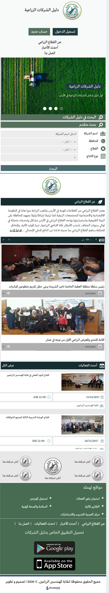

# دليل الشركات الزراعية — واجهة تجريبية

هذا المشروع يستلهم **تجربة وعرضًا قريبين** من موقع **نقابة المهندسين الزراعيين** ودليل الشركات الزراعية (محتوى وتركيب عام). التصميم منفّذ بـ **HTML / CSS / Bootstrap** مع **Owl Carousel** للشرائح، مع مراعاة **العرض المتجاوب** (هاتف، تابلت، شاشات أكبر) باستخدام شبكة Bootstrap ونقاط التوقف (breakpoints).

**الموقع الأصلي (مرجع المحتوى والهوية):**  
[http://www.agridaleel.com/Default.aspx](http://www.agridaleel.com/Default.aspx)

---

## لقطات من التنفيذ الحالي

الملفات في جذر المشروع: [`finished-proj-desktop.png`](./finished-proj-desktop.png) · [`finished-proj-phone.png`](./finished-proj-phone.png)

### عرض سطح المكتب (عرض واسع)

### عرض الهاتف (عرض ضيق)

---

## تشغيل محلي

1. افتح المجلد في المتصفح كملف ثابت، أو استخدم خادمًا محليًا بسيطًا (مثل `npx serve` أو Live Server في VS Code).
2. الصفحة الرئيسية: [`index.html`](./index.html).
3. صفحة عرض منفصلة للكاروسيل: [`Carousel.html`](./Carousel.html).

---

## توثيق إضافي

- [Bootstrap breakpoints — ملخص للمشروع](./Bootstrap-BreakPoints.md)
- [Owl Carousel — دليل الاستخدام](./docs/OWL-CAROUSEL.md)

---

## ملاحظة قانونية

هذا المستودع **لأغراض تعليمية / تجريبية**. المحتوى والشعار والعلامات التجارية في الموقع الأصلي ملك لأصحابه؛ لا تستخدم المواد في إنتاج تجاري دون إذن.
